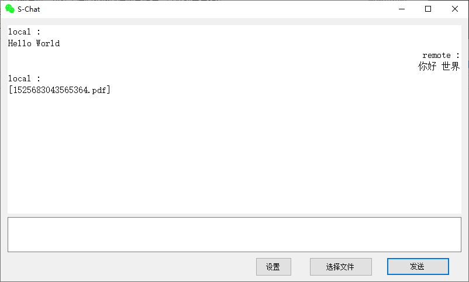
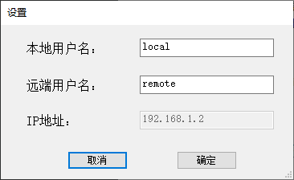
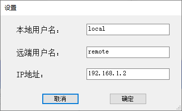

# Chat
简单的局域网聊天器

## 使用
* 第一次使用，客户端需要设置待连接的IP地址。之后再启动会自动连接
    1. 双击服务端exe启动，点击`设置`，查看IP地址项 
    
    2. 双击客户端exe启动，点击`设置`，在`IP地址`项，输入服务端查看到的IP地址  
    
    
* 设置成功后，等待大约一两秒，**应用cion变成绿色**，即表示连接成功，可以正常发送文字和文件了
* 可以点击`选择文件`（支持选择多个文件），发送文件
* 支持直接拖拽文件到输入框，发送文件
* 支持Ctrl+Enter快捷键发送
* 接收到的文件自动存放在exe所在目录的**ChatFiles**文件夹下
### 注意事项
* 客户端服务端需要在同一个局域网下才能实现连接
* 服务端IP地址是不支持修改的，自动读取本机的IP地址
## 更多
* 预编译好的可运行exe程序，在仓库的[Release](https://github.com/iwiniwin/Chat/tree/master/Release)目录
* 或者可以直接通过百度云[下载](https://pan.baidu.com/s/1PEf7sEX2ZU_w1LhJEZsaEg#list/path=%2F)，提取码`v4pe`
* 更详细的介绍，请点击[这里](https://www.cnblogs.com/iwiniwin/p/12501969.html)查看
